# Graph-Algorithms

This is a collaboration between [Eytan Ohana](https://github.com/eytanohana/Graph-Algorithms) and [Osher Boudara](https://github.com/osherboudara99/Graph-Algorithms) to implement and visualize various graph algorithms.

---

## Table of Contents
- [Breadth First Search](BFS.ipynb)
- [Depth First Search](DFS.ipynb)
- [Topological Sort](Topo-Sort.ipynb)
- [Dijkstra's Algorithm](Dijkstras-Algo.ipynb)
- [Euler Circuits](Euler-Circuits.ipynb)

A graph is a type of data structure that is represented by a set of nodes/vertices and edges. 

Graphs can be used to model many complex things like social networks where individuals are the nodes and connections between friends are the edges. 

Graphs and Graph algorithms are also widely used in navigation systems like google maps. The nodes can be intersections or popular destinations and the edges can be roads or highways connecting them. 

Additionally edges can be weighted which in the case of nav systems can represent some sort of measure for how long the road (edge) from point a to point b is, which can take in to account physical distance, traffic conditions, and other factors.

In graph theory, vertices can be accessed by computing a graph traversal. A graph traversal is an algorithm that "visits" each vertex in the graph. All types of traversal gives a specific order in which each vertex is visited. Two simple types of traversals in a graph are paths and cycles. A __path__ is sequence of non-repeating vertices connected by unique edges. A __cycle__ is a path where the start and end vertices are the same and each vertex on the path is unique. Graphs that don't contain any cycle are called __acyclic__. Along with cycles, __circuits__ are a type of cycle where vertices can repeat on the path. The left image displays a path, the middle image is a cycle, and the right image is a circuit.

    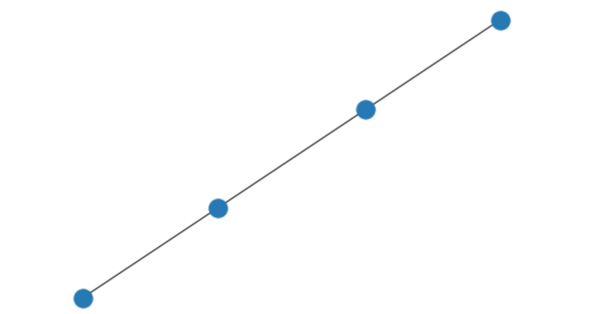
    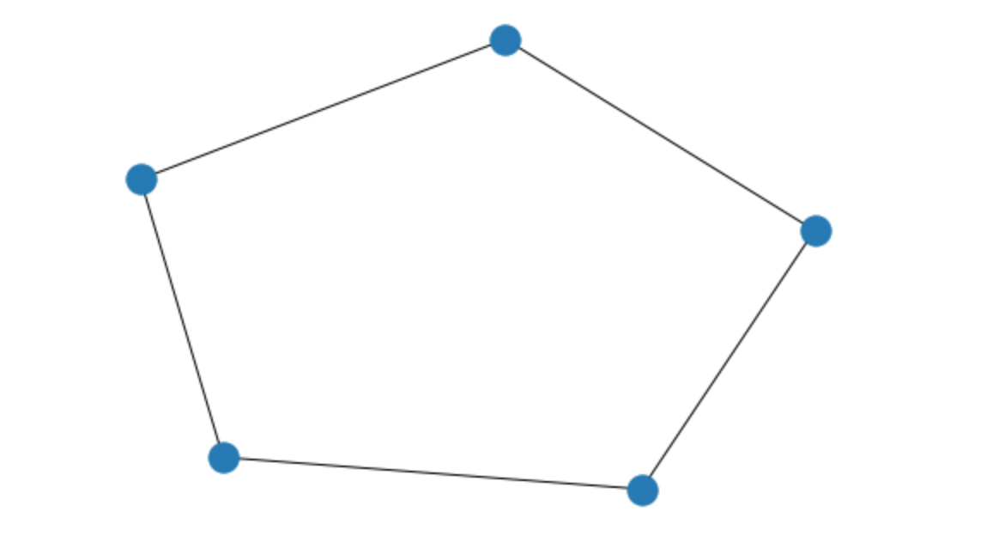
    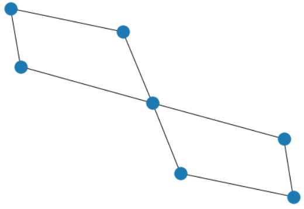

An __Euler Path__ is a path where every *edge* in the graph is used exactly once, while an __Euler Cycle__ (or Euler Circuit) is an euler path where the start vertex is equal to the end vertex.

A __Hamiltonian Path__ is a path where every *vertex* in the graph is used once. A __Hamiltonian Cycle__ is a hamiltonian path except again where the start is the same as the end.

An important property of graphs to discuss before further discussing traversals is the concept of __graph connectivity__. We say two vertices *u* and *v* are connected if there exists a path between them.

A graph is __connected__ if there exists a path between every pair of vertices in the graph and is __completely connected__, or __complete__ for short, if every vertex is connected to every other vertex by a single edge.

    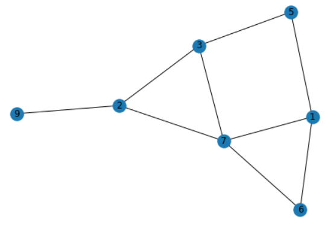
    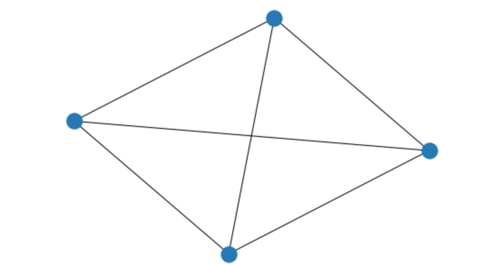

There are two common ways to represent a graph: the __adjacency list__ and the __adjacency matrix__.

The adjacency list is a list/array of the nodes in the graph where each node points to a list of nodes adjacent to it.

The adjacency matrix is a matrix where each row and column represents a node. For example, looking at row 0 and column 1 of the matrix, we see that there is a non-zero value there, implying an edge connection between the two vertices. In general, we see in the matrix two vertices, *u* and *v*, are connected if the adj matrix at row *u* column *v* is non-zero. 

    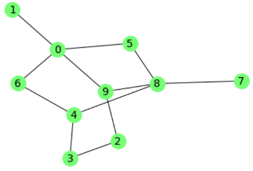
    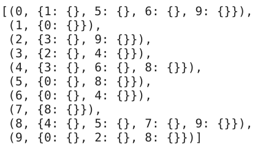
    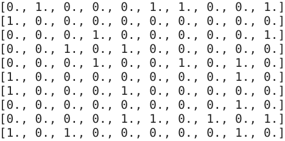

In this case, the adjacency matrix is symmetric about the main diagonal because the graph is undirected i.e. if vertices 0 and 2 are connected then the matrix will have a value at row 0 column 2 as well as row 2 column 0. If the graph had weights then the existence of an edge in the matrix would be represented by its weight value instead of 1 and in this case as well the lack of the edge remains as 0.

We will try to implement as many of these algorithms as we can using both the list and matrix representations of the graphs.

Another important topic in graph theory are trees. A tree is an undirected connected graph that doesn't contain any cycles. Trees have a few characteristic properties. A graph is a tree if it has the following properties:

1. It is connected and has no cycles.
1. If any edge is added to the graph, a cycle will be formed.
1. For every two vertices there is a unique path between them.
1. If any edge is removed from the graph, then the graph won't be connected anymore.

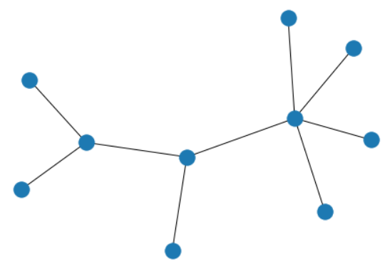

In graph theory, an important topic is finding a spanning tree of a graph. A spanning tree is a minimun set of edges that connects every node in the graph. A graph can only have a spanning tree if it is connected. 

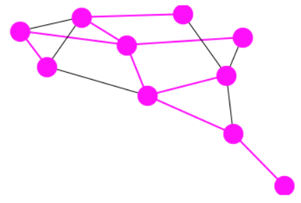

The spanning tree of the graph above consists of only the pink edges and nodes. Spanning trees are vital in any path-finding algorithm such as GPS where finding the shortest path is the goal.

Two simple, yet effective, algorithms for finding a spanning tree are [depth-first search](DFS.ipynb) and [breadth-first search](BFS.ipynb). __When run on any vertex in an *undirected unweighted* graph, BFS and DFS determine the shortest path from the start vertex to any other vertex reachable in the graph.__ 

---

Until now we have been talking about graphs with undirected edges. We also need to talk about graphs with directed edges, or __digraphs__, since they can be used to model many relationships that undirected graphs can't. 

For many algorithms, especially for digraphs, we need to know the __degree__ of a vertex. In an undirected graph, the degree of a vertex is just how many edges are connected to it (we count self loops twice). In a directed graph, the __in-degree__ of a vertex is the number of incoming edges to the vertex while the __out-degree__ is the number of outgoing edges from the vertex.

For example in the graphs below node 3 (left) has an in-degree of 2 and an out-degree of 1 while node 5 (right) has a degree of 5.

    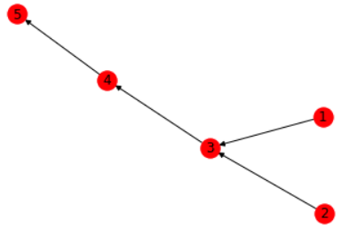
    

One application where digraphs are used is to solve the problem of task scheduling. Let's say you have a bunch of tasks to do and you can't do one task before doing the necessary tasks before it. Each task can be a node. We say a node *u* points to node *v* if task *u* must be executed before task *v*. This can be applied to choosing the order of which classes to take given that some classes are necessary prerequisites of others. We can even apply digraphs to putting clothes on in the morning; you can't put your shoes on before your socks.

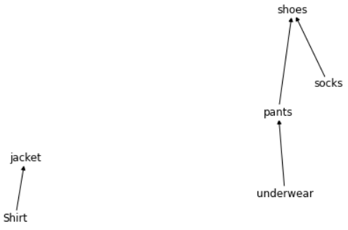

A problem we want to solve is to find a natural ordering of the tasks or in this case, putting on clothes, so that each task done has no unfulfilled prerequisites. Meaning, for every two nodes *u* and *v*, if node *u* points directly to node *v* or there is a directed path from *u* to *v* in the graph then *u* preceeds *v* in the ordering.

We can see there are many valid outputs for this digraph/problem:
1. underwear, pants, socks, shoes, shirt, jacket
1. underwear, shirt, jacket, pants, socks, shoes
1. underwear, shirt, jacket, socks, pants, shoes
1. socks, underwear, pants, shirt, shoes, jacket
1. socks, underwear, pants, shoes, shirt, jacket

and the list goes on.

"underwear, pants, shoes, socks, shirt, jacket" would be invalid since shoes comes before socks in the order but socks points to shoes in the graph.

The ordering we get is known as a topological sort of the graph and the algorithm that solves this problem is unsurprisingly called [Toposort](Topo-Sort.ipynb) and is actually a very simple algorithm to understand.

## Pathfinding algorithms

There are many path finding algorithms out there. They all come in different flavors. Some are __single source shortest path algorithms__ that find the shortest path from a single vertex to every other vertex in the graph. Others are __all-pair shortest paths algorithms__ which find the shortest path from any vertex to any other vertex in a graph.

A common path finding algorithm is called [Dijkstra's Algorithm](Dijkstras-Algo.ipynb). Briefly, Dijkstra's algorithm is a single source shortest path algorithm.

Graphs are applicable in so many situations that thousands of algorithms have been developed for them. Algorithms like shortest path, spanning trees, graph traversals, topological sorts and more. 
